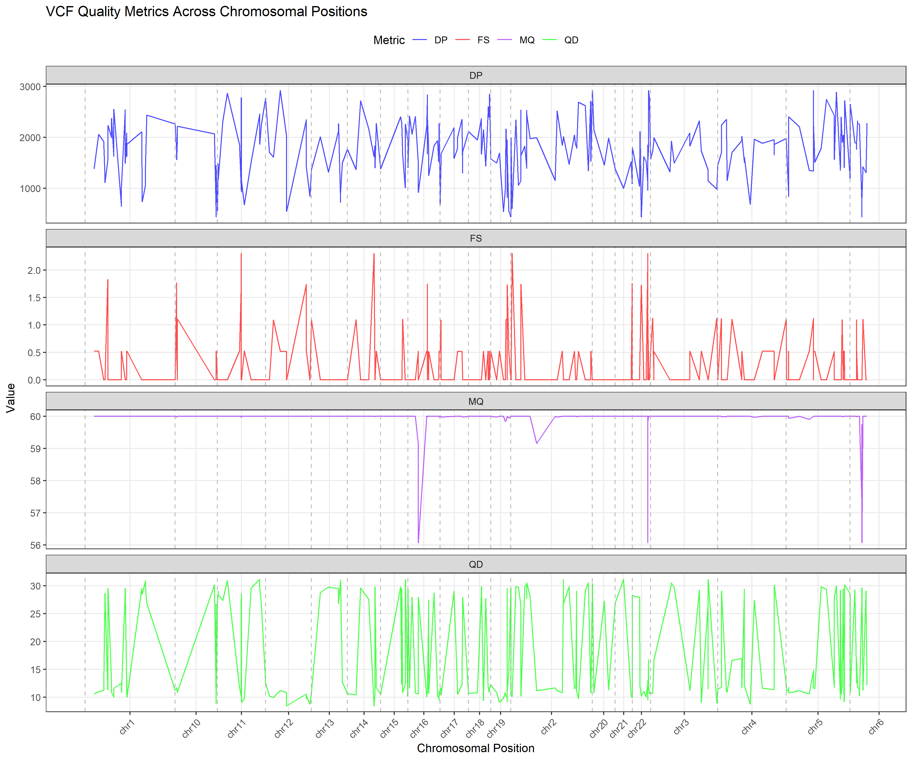

# VCF_Quality_Metrics_line_graph
R and Python script to prepare .png image for common quality metrics of VCF file

## R 

Rscript usage provided below :

```sh
Rscript vcf_metrics_plot_v2.R -i input.vcf -o output.png
```

Script was tested in R 4.5.0 for VCF file format - 4.2.

Install the mentioned packages and confirm the 4 metrics are present in the .vcf file.

> install.packages(c("ggplot2", "data.table", "dplyr", "tidyr","tools", "optparse"))

The ouput can be something similar as the given examples below.

 
 
